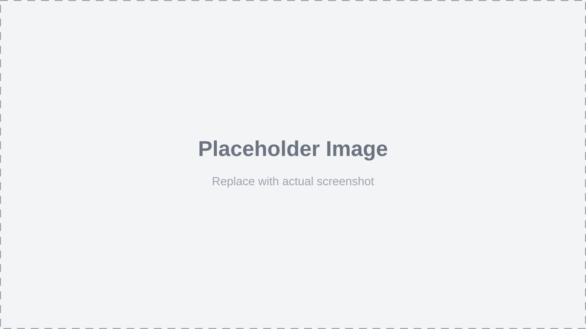

# BionicProducer — How-To Guide

A step-by-step guide to installing, configuring, and using **BionicProducer** (JBAiVideoSuite).

> **Status:** Work in progress. Screenshots are placeholders and will be replaced with real captures as the UI stabilizes.

---

## Table of Contents

1. [Installation](#installation)
2. [Settings](#settings)
   - [App Settings](#app-settings)
   - [LLM Settings](#llm-settings)
   - [Backend Settings](#backend-settings)
   - [ComfyUI Settings](#comfyui-settings)
   - [ComfyUI Workflows](#comfyui-workflows)
   - [System Prompts](#system-prompts)
3. [Status Indicators](#status-indicators)
4. [Comfy Generation Tab](#comfy-generation-tab)
5. [Direct The Video Tab](#direct-the-video-tab) *(coming soon)*

---

## Installation

BionicProducer is a local-first video production suite. It has two halves:

- **Backend** — a FastAPI + Prisma (SQLite) service on port `8000`
- **Frontend** — a Next.js dev server on port `3000`

Both are launched together by the `StartApp.bat` script at the repo root.

### Prerequisites

| Tool | Version | Notes |
|------|---------|-------|
| Python | 3.12+ | Used by the backend venv |
| Node.js | 20+ | Used by the frontend |
| LM Studio | latest | Local LLM server (OpenAI-compatible API) |
| ComfyUI | latest | Image/video generation server |

### Step 1 — Clone the repository

```powershell
git clone <repo-url> BionicProducer
cd BionicProducer
```

### Step 2 — Set up the backend

The backend lives in `backend/` and ships with a pre-built virtual environment (`backend/.venv`). If you are cloning fresh, recreate it:

```powershell
cd backend
python -m venv .venv
.venv\Scripts\activate
pip install fastapi uvicorn prisma-client-py prisma httpx
```

Then generate the Prisma client and create the SQLite database:

```powershell
prisma generate
prisma db push
```

> The database file is created at `backend/prisma/database.db`. Default settings (LLM, backend, ComfyUI) are seeded automatically on first startup.

### Step 3 — Set up the frontend

```powershell
cd ..\frontend
npm install
```

### Step 4 — Launch the app

From the repo root, double-click **`StartApp.bat`** (or run it from a terminal). It will:

1. Start the FastAPI backend in a new console window (`uvicorn main:app --reload --port 8000`)
2. Start the Next.js frontend in another console window (`npm run dev`)
3. Wait 3 seconds, then open `http://localhost:3000` in your default browser



> **Tip:** Keep both console windows open while you work. Closing them stops the corresponding service.

### Step 5 — Verify the install

- Backend health: open `http://127.0.0.1:8000/` — you should see `{"message": "BionicProducer API is running"}`
- Frontend: the app header should read **JBAiVideoSuite** with the tabs *Direct The Video* and *Comfy Generation*

---

## Settings

The **Settings** page is reachable from the app header. It has six tabs, each covering a different area of configuration.


### App Settings

Maps **system prompts** to app actions, and **ComfyUI workflows** to generation actions. Also holds the resolution presets used for asset and video generation.


**LLM System Prompt Mapping** — for each app action, pick which system prompt file (from `assets/systemprompts/`) to use. Leave as *None* to use the built-in default.

| Action | Purpose |
|--------|---------|
| Develop Raw Story | Expands a raw story idea into a narrative arc |
| Extract Cast | Pulls characters, locations, and props from the story |
| Generate Script | Writes the episode script from the story |
| Generate Prompt | Builds image prompts for assets |
| Generate Video Prompt | Builds video prompts for shots |
| Refine Dialog | Polishes dialogue lines |
| Generate Shots | Breaks the script into a shot list |

**ComfyUI Generation Mapping** — for each generation action, pick which workflow JSON file (from `assets/workflows/`) to use.

| Action | Purpose |
|--------|---------|
| Asset Generation | Generates character/location/prop images |
| Character Sheet Generation | Generates a character reference sheet |
| MinimaxH3 Ref2VA Generation | Generates video clips from reference images |

**Resolution Settings** — under *Asset Generation*, set the output resolution for each asset type (character, location, prop). Under *MinimaxH3 Ref2VA Generation*, set the low-res and high-res video resolutions.

Click **Save Mappings** to persist everything.

> Two collapsible sections at the bottom show the **Expected Asset JSON Format** and **Expected Shot JSON Format** — useful when writing custom system prompts.

### LLM Settings

Connects to your local **LM Studio** server.


| Field | Description |
|-------|-------------|
| IP Address | Host running LM Studio (e.g. `127.0.0.1`) |
| Port | LM Studio's OpenAI-compatible port (default `1234`) |
| Model Name | The model identifier LM Studio reports |
| Temperature | Sampling temperature (default `0.7`) |

Click **Test Connection & List Models** to verify the connection. A green `🟢 Healthy` status means the server is reachable and at least one model is loaded. A red `🔴 Unreachable` means LM Studio is not running or the IP/port is wrong.

The list of available models appears below the test button. Pick one as your **Model Name**.

Click **Save LLM Settings** to persist.

### Backend Settings

Points the frontend at the backend API.


| Field | Description |
|-------|-------------|
| API URL | Backend base URL (default `http://127.0.0.1:8000`) |
| Database Path | Path to the SQLite database (default `backend/prisma/database.db`) |

Click **Save Backend Settings** to persist.

### ComfyUI Settings

Connects to your local **ComfyUI** server.


| Field | Description |
|-------|-------------|
| IP Address | Host running ComfyUI (default `127.0.0.1`) |
| Port | ComfyUI's port (default `8188`) |
| Device ID | GPU device index (default `0`) |
| Poll Interval (ms) | How often to poll for task completion (default `4000`) |

Click **Test Connection & Status** to verify the connection. Click **Save ComfyUI Settings** to persist.

### ComfyUI Workflows

Manages the ComfyUI workflow JSON files available to the app.


- **Add New Workflow JSON** — upload a `.json` workflow file. It is stored in `assets/workflows/` and becomes selectable in *App Settings → ComfyUI Generation Mapping*.
- **Refresh** — re-reads the `assets/workflows/` directory.
- The list below shows all available workflows. Click one to select it.

### System Prompts

Manages the system prompt `.txt` files available to the app.


- **Add New System Prompt (.txt)** — upload a `.txt` prompt file. It is stored in `assets/systemprompts/` and becomes selectable in *App Settings → LLM System Prompt Mapping*.
- **Refresh** — re-reads the `assets/systemprompts/` directory.
- The list below shows all available prompts. Click one to select it.

---

## Status Indicators

The app header shows two live status indicators so you can see at a glance whether your LLM and ComfyUI servers are reachable.


### LLM Status

The **LLM** indicator shows the state of your LM Studio connection:

| Indicator | Meaning |
|-----------|---------|
| `🟢 <model-name>` | A model is loaded and ready to use |
| `🔵 No Models Loaded` | LM Studio is reachable but no model is loaded |
| `🔴 UNREACHABLE` | LM Studio is not running or the IP/port is wrong |

**Buttons next to the LLM status:**

| Button | When it appears | What it does |
|--------|----------------|--------------|
| 🔄 (refresh icon) | Always | Re-checks LLM and ComfyUI status |
| ➕ (plus icon) | When `🔵 No Models Loaded` | Loads the configured model into LM Studio |
| ➖ (minus icon) | When `🟢 <model-name>` | Unloads the model from LM Studio (frees VRAM) |

> **Tip:** Unload the model when you're done generating to free up VRAM for ComfyUI. Load it again when you need to generate text.

### ComfyUI Status

The **ComfyUI** indicator shows whether your ComfyUI server is online:

| Indicator | Meaning |
|-----------|---------|
| `🟢 Online` | ComfyUI is reachable and ready to accept jobs |
| `🔴 Offline` | ComfyUI is not running or the IP/port is wrong |

**Buttons next to the ComfyUI status:**

| Button | When it appears | What it does |
|--------|----------------|--------------|
| 🔄 (refresh icon) | Always | Re-checks LLM and ComfyUI status |

> Both status indicators are checked automatically when the app loads. Use the refresh button to re-check after starting or stopping a server.

---

## Comfy Generation Tab

The **Comfy Generation** tab is a standalone playground for running ComfyUI workflows directly — no project required. It's useful for testing prompts, generating reference images, or producing assets outside the main video pipeline.


The tab is split into two columns:

### Left Column — Gallery

A grid of all images and videos in `assets/generated/`.


- **Add** — upload a new image to the gallery
- **Refresh** — re-read the `assets/generated/` directory
- **Click an image** — opens a detail modal where you can:
  - **Delete** — remove the image from the gallery
  - **Map to Asset** — assign the image to a character, location, or prop in your current project (select type → asset → state → image type → Assign)

> Videos in the gallery are marked with a small **VIDEO** badge in the top-right corner.

### Right Column — Workflow Selector + Preview

**Workflow Selector** — a dropdown listing all workflows from `assets/workflows/`. Next to it, a status badge shows:

- `Gen complete` (green) — no tasks in the queue
- `N tasks queued` (amber) — N generations are currently running

**Preview** — once a workflow is selected, its inputs are parsed and displayed:


| Section | Description |
|---------|-------------|
| **Result preview** | Shows the generated image or video once complete. Displays "Result will appear here" while waiting. |
| **Seed** | Numeric seed input with a **Random** button (only if the workflow has a seed node) |
| **Float inputs** | Any float-type inputs from the workflow (e.g. strength, scale) |
| **Resolution** | Dropdown of common resolutions (512×512 through 3840×2160) plus manual W/H inputs |
| **Generate** | Queues the generation. Becomes **Queue Another** while a task is running |
| **String inputs** | Textareas for prompt strings (one per string input in the workflow) |
| **Images** | Image pickers for each image input role (e.g. reference images) |
| **Audio** | Audio pickers for each audio input role (e.g. voice samples) |

> **How it works:** When you click **Generate**, the app uploads any selected image/audio files to ComfyUI, injects all input values into the workflow JSON, and queues the job. The app polls ComfyUI at the configured interval (default 4 s) until the result is ready, then displays it in the preview area.

> **Note:** If no workflows are available, the tab shows a message directing you to add some in **Settings → ComfyUI Workflows**.

---

## Direct The Video Tab

*(Coming soon — see next update)*
